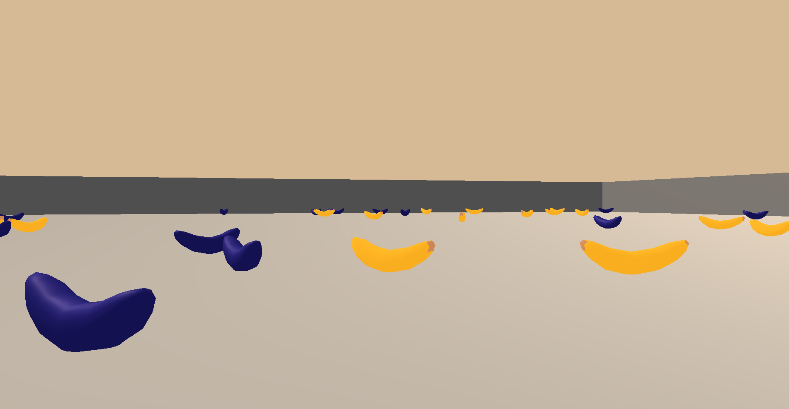

# Deep Reinforcement Learning Navigation

This repository contains a solution for the
[Udacity DRL Nanodegree](https://www.udacity.com/course/deep-reinforcement-learning-nanodegree--nd893)
[Project 1 - Navigation.](https://github.com/udacity/deep-reinforcement-learning/tree/master/p1_navigation)
This project trains a Deep Q-Network to solve the [Unity](https://unity.com/) Banana Navigation Task
(screen shot below).

## The Environment

This environment, like most that are used in Reinformcent Learning (RL), is structured as a
[Markov Decision Process](https://en.wikipedia.org/wiki/Markov_decision_process) (MDP). This
means that it has a defined <b>state space</b>, $ S $, a defined <b>action set</b>, $ A $,
a probabilistic transition function that defines the transition from one state to the next
and a reward function to compute the reward, $R$ at every time step $ t $. MDPs traditionally
operate in fixed, discrete time intervals.

The state space, $ S \in \mathbb{R}^{37} $, has 37 different features which include velocity
and a representation of all the bananas surrounding the agent. This vector gives the agent
a perception of its surroundings in terms of what it really cares about - bananas. The
action space, $ A \in [0, 1, 2, 3] $ is a discrete integer space from 0 to 3 inclusive. Each
of these integers represent a different action that the agent can perform:
* <code>0</code>: move forward
* <code>1</code>: move backward
* <code>2</code>: turn left
* <code>3</code>: turn right

The transition function for this problem is quite simple. Driven by the [Unity](https://unity.com/)
game engine, the agent will be moved or rotated a small amount according to the requested action.
These transitions are deterministic (i.e. there is no chance that it will do something other
than what has been requested). Finally, the reward function will return a score of $ +1 $
when a yellow banana is collected (simply by colliding with it) and a score of $ -1 $ when
collecting a blue banana. The goal, of course, is to maximize the total reward received over
time, which is a sum of all the scores at every timestep.

The environment is considered scored when an agent can receive an average score of 13
(or greater) over 100 episodes.

## Background

The most simple agent could do nothing as it would never receive a negative reward, but it
would never receive a positive award as well. The goal here is to train an agent that can
maximize its reward over time, even if that means we have to collect a few blue bananas in
the process. This exemplifies one of the fundamental problems solved with reinforcement
learning - how can an agent learn to make decisions that maximize future reward instead
of just immediate gratification? The answer is typically addressed with the
[Bellman Equation](https://en.wikipedia.org/wiki/Bellman_equation) from the field of
[Dynammic Programming](https://en.wikipedia.org/wiki/Dynamic_programming)
(which RL is built upon). In RL and Dynammic Programming the states of an MDP are
described by their <b>value</b> indicating the goodness of any state by the potential
accumulated reward that can be received from that state. According to the Bellman Equation
this is written as:
$
v_\pi(s)=\mathbb{E}_\pi\[R_{t+1}+\gamma v_\pi(s_{t+1})|s_t=s\]
$
Importantly this is showing that the value of any state can be represented by the
score at the given state, $ R_{t+1}, $ plus the value of the following state, $ v_\pi(s_{t+1} $.
This shows an important recursive nature of the MDP that Dynammic Programming paradigms
capitalize on. Additionally, the $ \gamma $ value is used to <b>discount</b> the future
return when considering the value of the state. If $ \gamma $ were set to $ 0 $ then the
value of each state would be equal to the reward returned at that state only. If $ \gamma $
were set to $ 1 $ that value would fully emcompass all future rewards as well. In practice
$ 0 < \gamma < 1 $ which can help to account for uncertainty in future estimation but
still consider future reward when making decisions. $ \gamma $ is one of the important
hyperparameters that is explored within this project.

Another important aspect of RL is <b>exploration vs exploitation</b>. While learning
there is an important balance between <b>exploring</b>, taking an action with unknown
consequences, and <b>exploiting</b>, doing what you currently <i>think</i> is best. The
only way to learn is to try new strategies and see what works, but simultaneously the
agent needs to be refining strategies that it knows work. This is the mathematical equivalent
of our own learning by trial and error processes. During training this is modeled with
an <b>$ \epsilon $-greedy policy</b> that will sometimes act randomly and sometimes act
optimally depending at a rate defined by the hyperparameter $ \epsilon $. $ \epsilon $ is
decayed during training and a well tuned $ \epsilon $ can make the difference between
an agent that learns nothing and an expert agent. This field is another important value
that is explored within this project.

## Installation and Configuration

In order to run this code please follow these steps:

1) Checkout the Udacity DRL Gitlab [repository](https://github.com/udacity/deep-reinforcement-learning)
1) In the Udacity repository navigate to <code>deep-reinforcement-learning/python</code> and run <code>pip install -e .</code> (note you may want to do this in a python <code>venv</code>)
1) Download and install the Unity Banana executable [here](https://github.com/udacity/deep-reinforcement-learning/tree/master/p1_navigation)
1) Checkout this repository
1) Run <code>pip install -e .</code> to install this code and its dependencies (use the same <code>venv</code> if using one)
